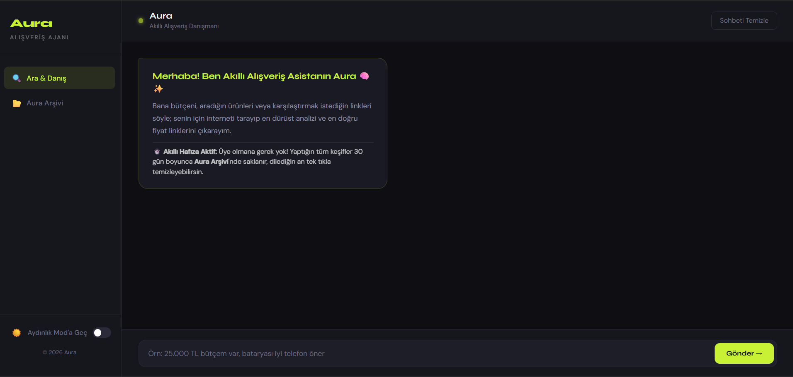
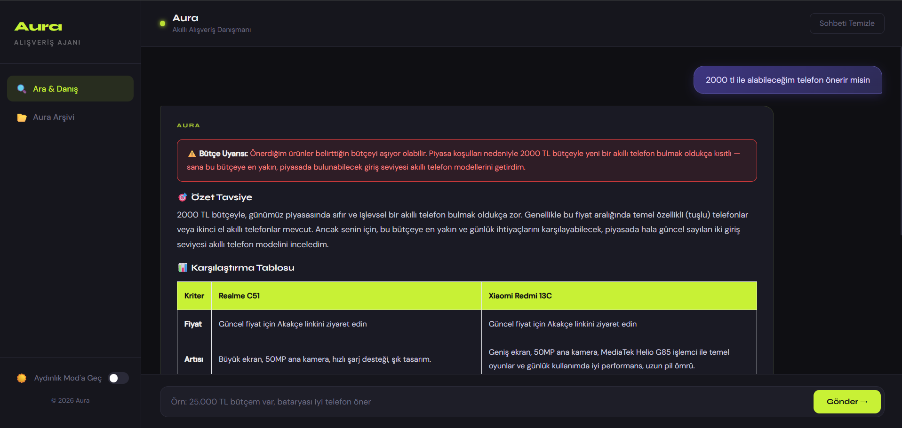
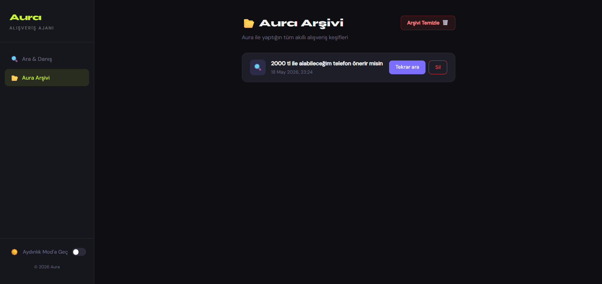

# 🛡️ Aura — Yapay Zeka Destekli Akıllı Karar & Alışveriş Danışmanı

> 🏆 **Bu proje, BTK Akademi Hackathon 2026 için geliştirilmiştir.**

> 🌐 **Canlı Demo:** [auraasistan-001-site1.rtempurl.com](http://auraasistan-001-site1.rtempurl.com/)

Aura; geleneksel ve statik e-ticaret filtreleme yöntemlerinin ötesine geçerek, karmaşık veri yığınlarını işleyen ve kullanıcılar için en doğru kararları veren bulut tabanlı bir yapay zeka asistanıdır. Kullanıcıları sahte indirimlerden, bütçe aşımından ve yanlış ürün seçiminden korur.

## ⚡ Aura Nasıl Çalışır? (Temel İşleyiş)

Aura, kullanıcının girdiği bütçe ve kriterlere göre arka planda dinamik bir mühendislik algoritması çalıştırır:

1. **Doğal Dil İşleme & Sorgu Analizi:** Kullanıcıdan gelen istekleri analiz eder; eğer bütçe veya teknik kriterlerde eksik bilgi varsa doğrudan ürün önermek yerine kullanıcıya akıllı sorular sorar.
2. **Canlı Forum & Yorum Taraması (NLP):** Bağımsız forumları, teknoloji sitelerini ve gerçek kullanıcı şikayetlerini/yorumlarını derinlemesine okuyarak yapay zeka ile analiz eder (Duygu Analizi).
3. **Anlık Fiyat & Google Entegrasyonu:** En güncel fiyat geçmişini ve arama sonuçlarını gerçek zamanlı olarak senkronize eder.
4. **Kişiselleştirilmiş Karşılaştırma Tablosu:** Süzülen tüm bu dinamik verileri işleyerek, kullanıcıya ürünlerin artılarını, eksilerini ve jüriye özel yapay zeka tavsiyelerini içeren **Kapsamlı bir Karşılaştırma Tablosu** sunar.

## ✨ Özellikler

- 🧠 **Akıllı Danışman** — Eksik bilgi varsa soru sorar, doğrudan ürün önermez.
- **⏱️ Akıllı Hafıza (30 Günlük Depolama):** Herhangi bir üyelik gerektirmeden, kullanıcının yaptığı aramalar ve keşifler 30 gün boyunca yerel hafızada (Aura Arşivi) saklanır.
- 💰 **Bütçe Kalkanı** — Bütçeni aşan ürünleri filtreler, uyarı verir.
- 📊 **Kategori Analizi** — Laptop için FPS/ısınma, tencere için yapışmazlık kriterleri.
- 🗣️ **Yorum Analizi** — Bağımsız forum ve sitelerden gerçek kullanıcı yorumları.
- 🌙 **Karanlık/Aydınlık Tema** — Kullanıcı tercihine göre tema değişir.

  ## 🛠️ Teknolojiler

- **Backend:** ASP.NET Core (C#)
- **AI:** Google Gemini 2.5 Flash
- **Arama:** Serper API (Google Search)
- **Veritabanı:** Firebase Realtime Database
- **Frontend:** Razor Views, HTML/CSS/JS
## 🚀 Kurulum

```bash
# Repoyu klonla
git clone https://github.com/kullaniciadi/aura

# appsettings.json'a API key'lerini ekle
GeminiSettings:ApiKey=...
SerperSettings:ApiKey=...
Firebase URL=...

# Çalıştır
dotnet run
```
## 📸 Ekran Görüntüleri

### Ana Sayfa


### Bütçe Uyarısı


### Arama Geçmişi


## 👥 Ekip
-Fatma Nur ATAGÜN 

-Hayrunnisa KAYA
